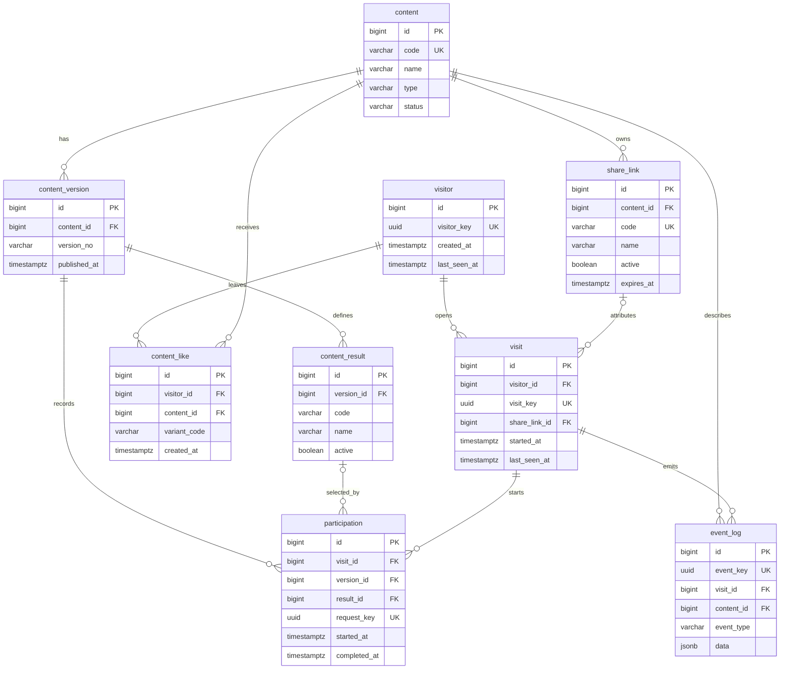

# Engagement & Anonymous Analytics v0.1

온기의 여러 콘텐츠에서 공통으로 사용하는 익명 조회·참여·완료·좋아요·공유 기록 기반이다. 로그인이나 실제 사람 식별 없이 제품 흐름과 콘텐츠 반응을 이해하는 데 필요한 최소 데이터만 저장한다.

## 핵심 정의

- `visitor`는 실제 사람이 아니라 브라우저 저장소에 보관한 임의 UUID를 뜻한다.
- `visit`는 한 브라우저 탭/세션의 방문이다. 한 visitor가 여러 visit을 가질 수 있다.
- 조회는 `CONTENT_VIEW` 이벤트이며 참여와 다르다.
- 참여는 `participation` row가 만들어진 시점부터 시작한다.
- 완료는 기존 participation에 `completed_at`과, 결과형 콘텐츠라면 `result_id`가 기록된 상태다.
- `participation_count`는 participation row 수이고 `participant_count`는 참여한 distinct visitor 수다.

따라서 다음 관계를 항상 유지한다.

```text
조회 != 참여
participation_count != participant_count
visitor != 실제 사람
visit != visitor
```

## ERD



## 테이블 역할과 정합성

| 테이블 | 역할 | 주요 정합성 |
|---|---|---|
| `visitor` | 익명 브라우저 | `visitor_key` unique |
| `visit` | 탭/세션 단위 방문 | `visit_key` unique, visitor 연결 불변 |
| `content` | 콘텐츠 master | `code` unique, 삭제 대신 `ARCHIVED` 우선 |
| `content_version` | 통계를 분리할 콘텐츠 버전 | `(content_id, version_no)` unique |
| `content_result` | 버전별 허용 결과 | `(version_id, code)` unique |
| `participation` | 참여 시작과 완료의 source of truth | `request_key` unique |
| `content_like` | 익명 좋아요 | `(visitor_id, content_id, variant_code)` unique |
| `event_log` | 조회와 공유 같은 가벼운 행동 | `event_key` unique, type별 data whitelist |
| `share_link` | 공동체·행사 링크 단위 attribution | `code` unique, active/expiry 검사 |

`participation`의 `(result_id, version_id)`는 `content_result`의 `(id, version_id)`를 참조하는 복합 FK다. 서비스 검증과 함께 다른 버전 결과가 연결되는 것을 DB에서도 차단한다.

## 익명 식별과 개인정보

Frontend는 다음 키를 사용한다.

```text
localStorage  ongi_visitor_id
sessionStorage ongi_visit_id
```

브라우저 저장소가 차단되면 현재 페이지의 메모리 UUID로 동작한다. 저장소를 삭제하면 새 visitor로 인식되는 것은 허용한다.

Engagement DB에는 이름, 전화번호, 이메일, 생년월일, 성별, 위치, 원본 IP, 전체 User-Agent, device fingerprint, 문항별 답변을 저장하지 않는다. IP는 기존 방 입장 rate limit처럼 요청 처리에 사용할 수 있지만 이 analytics schema에는 영구 저장하지 않는다.

## API

기본 경로는 `/api/engagement`다. 변경 요청은 기존 정책대로 `X-OnGi-Client: web`을 보낸다.

| Method | Path | 역할 |
|---|---|---|
| `PUT` | `/visitors/{visitorKey}` | visitor 생성 또는 `last_seen_at` 갱신 |
| `PUT` | `/visits/{visitKey}` | visit 생성 또는 갱신, 선택적 share link 연결 |
| `GET` | `/contents/{contentCode}` | 공개 콘텐츠의 현재 버전과 허용 결과 조회 |
| `POST` | `/participations` | `request_key`로 참여 시작 |
| `PUT` | `/participations/{id}/completion` | 기존 참여 완료 및 결과 연결 |
| `GET` | `/contents/{contentCode}/like?visitorKey=&variant=` | visitor의 variant별 좋아요 여부와 수 조회 |
| `PUT` | `/contents/{contentCode}/like` | `variantCode` 단위 idempotent 좋아요 |
| `DELETE` | `/contents/{contentCode}/like?visitorKey=&variant=` | variant별 idempotent 좋아요 취소 |
| `POST` | `/events` | `PAGE_VIEW`, `CONTENT_VIEW`, `SHARE_CLICK` 기록 |
| `GET` | `/statistics` | 홈에 표시할 누적 익명 visitor 수 조회 |
| `GET` | `/contents/{contentCode}/statistics` | 공개 가능한 콘텐츠 집계 조회 |
| `GET` | `/share-links/{code}` | 유효한 공유 링크의 공개 정보 조회 |

관리자 인증이 없으므로 서비스 전체 상세 통계와 share link 상세 통계는 service/query까지만 구현하고 public endpoint로 열지 않는다.

## 이벤트 정책

| 이벤트 | content | data | 호출 시점 |
|---|---|---|---|
| `PAGE_VIEW` | 없음 | 없음 | 앱 진입 후 visit 초기화 시 탭당 1회 |
| `CONTENT_VIEW` | 필수 | 없음 | 공개 콘텐츠 화면에 진입할 때 |
| `SHARE_CLICK` | 필수 | `{ "target": "native" }` 또는 `{ "target": "copy_link" }` | 실제 공유 또는 링크 복사가 끝났을 때 |

참여 시작·완료와 좋아요는 전용 테이블이 source of truth이므로 `event_log`에 중복 저장하지 않는다. 임의 JSON key나 허용되지 않은 공유 target은 backend가 거부한다.

## Frontend 연결 시점

| 콘텐츠 | 조회 | 참여 시작 | 완료 | 결과 |
|---|---|---|---|---|
| 마음속 흔적 찾기 | 화면 진입 | 테스트 시작 | 결과 계산 완료 | `bear`, `spring`, `effort`, `pause`, `express` |
| 극과 극 밸런스 게임 | 화면 진입 | 질문 진행 시작 | 마지막 질문 완료 | 저장하지 않음 |
| 최애 월드컵 | 화면 진입 | 토너먼트 시작 | 우승 후보 확정 | v0.1에서는 저장하지 않음 |
| 오늘은 누구? | 화면 진입 | 유효한 뽑기 시작 | 결과 화면 진입 | 저장하지 않음 |
| 익명으로 만나는 우리 | 화면 진입 | 방 생성 또는 입장 성공 | 방의 나눔 완료 | 저장하지 않음 |

홈 브랜드 영역에는 누적 익명 visitor 수를 표시한다. 공개 콘텐츠 화면 우측 상단에는 공통 좋아요 상태·개수와 기존 공유 버튼을 같은 규격으로 보여준다. 각 콘텐츠 accent 색은 유지한다. 분석 API가 실패해도 홈과 콘텐츠 진입·진행은 막지 않으며 한 번의 실패를 무한 재시도하지 않는다. 좋아요 실패는 해당 위치에 사용자 안내를 보여준다.

좋아요는 다음 variant별로 독립 집계한다.

- 밸런스 게임: `light`, `deep`
- 최애 월드컵: `meal`, `dessert`, `late-night`, `travel`, `free-pass`, `life-cheat`
- 오늘은 누구?: `prayer`, `sharing`, `lottery`, `ladder`, `groups`, `pairs`, `supporter`
- 단일형 콘텐츠: `default`

Frontend는 마지막 정상 방문자 수와 variant별 좋아요 응답만 현재 브라우저에 캐시하고 백그라운드에서 최신 값으로 갱신한다. 최초 응답 전에는 임시 0을 표시하지 않는다. 좋아요 클릭은 즉시 화면에 반영하고 요청 실패 때만 이전 상태로 되돌린다. 이 캐시에는 이름·연락처·IP 등 개인정보가 들어가지 않는다.

공유 동작은 콘텐츠 흐름에 맞게 연결한다.

| 콘텐츠 | 상단 링크 공유 | 추가 공유 지점 |
|---|---|---|
| 마음속 흔적 찾기 | 전용 링크 | 결과 이미지 시스템 공유 |
| 극과 극 밸런스 게임 | 전용 링크 | 없음 |
| 최애 월드컵 | 카테고리별 전용 링크 | 우승 이미지 시스템 공유 |
| 오늘은 누구? | 도구 모드별 전용 링크 | 결과 이미지 시스템 공유 |
| 익명으로 만나는 우리 | 없음 | 방 참여 링크 복사 |
| 구르미 티저 | 없음 | 없음 |

최애 월드컵의 `meal`, `dessert`, `late-night`, `travel`, `free-pass`, `life-cheat`는 각각 별도 URL, 제목, 설명, accent와 Open Graph 이미지를 사용한다. 기존 `/share/ideal-world-cup/` 링크는 이전 공유 호환을 위해 유지한다.

구르미 테스트는 현재 `DRAFT` seed이므로 조회·참여·좋아요 수집 대상에서 제외한다.

## 통계 기준

- 서비스: 누적 visitor, 오늘 생성된 visitor, visit, `PAGE_VIEW`
- 콘텐츠: `CONTENT_VIEW`, distinct viewer, participation, distinct participant, completion, completion rate, 전체 like, variant별 like, share
- 결과형 콘텐츠: content version별 결과 수와 완료 대비 비율
- share link: 연결된 visit, participation, completion, result distribution

완료율은 `completion_count / participation_count * 100`이며 분모가 0이면 0이다.

## Share link와 향후 확장

통계 귀속용 공유 URL은 현재 router 구조에 맞춰 `?activity=<content>&share=<code>` 형태로 연결할 수 있다. 유효한 code로 처음 생성되는 visit에 `share_link_id`를 고정한다. 만료·비활성 링크는 거부하고, code는 최소 6자의 추측하기 어려운 값으로 생성한다. 일반 콘텐츠 공유 미리보기 URL과 이 attribution용 `share_link`는 서로 다른 목적이다.

향후 실제 공동체 관리가 필요해지면 아래 방향으로 확장한다.

```text
organization -> community -> share_link -> visit -> participation
```

v0.1에는 organization/community 테이블이나 관리 UI를 미리 만들지 않는다.

## v0.1에서 제외한 범위

- 로그인, 회원가입, OAuth, profile
- 공동체·교회 관리 UI와 관리자 dashboard
- share link 생성·관리 public API
- 질문별 선택 답변 저장
- 월드컵 후보 master와 우승 결과 수집
- Kafka, Redis Stream, warehouse, 실시간 analytics
- 새 rate limit 라이브러리 도입

요청량이 실제로 늘면 현재 집계 쿼리를 기준으로 일별 summary table이나 batch aggregation을 추가한다.
